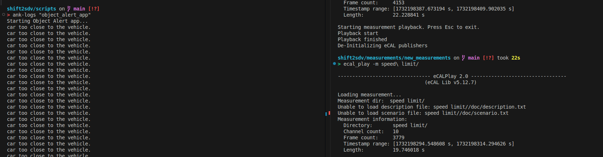

## Intelligent Auto - Transcending the driving hassle free.

To convert the convert the conventional vechicle to into a SDV we used sensors and measurements from the vehicle published over eCAL network and built apps that help estimate
1. Vehicle Stability
2. Traffic rules violation Check
3. Collison Detection
4. Vehicle health monitoring
5. Know Your Breaks

### Vehicle Stability
Vehicle stability measure how stable the vehicle is in the road, this is estiamted using Vehicle Yaw rate, Steering angle and lateral acceleration. This in turn denotes if the driver is awake.

### Traffic rules violation check: 
This app checks for the Traffic speed limitations and Traffic warning and alert the user on the warnings. This app uses YOLO object dectection data to detect the traffic signals. 

### Collision detection
This app checks for collison detection of vehicles such as car, trucks etc and pedestrians. A Safety region of interest is defined using the Camera's FOV and if any object comes in the roi user will get warnings. 

### Vehicle health monitoring
This app measures the Vehicle health based on the Vehicle acceleration, deceleration and speed to check for Jerks, Quick acceleration/deceleration etc. This app is built with the idea that we can monitor various sensors in the vechile and predict a score as vehicle health - so that user would get to know about the vehicle better. 

For the hackathon purpose we used existing signals and predicted a score based on user driving pattern. 

### Know your breaks
This app is enable by a click of a button denoting user is going for a long drive. In the long drive, this app finds out whether the user had taken break it between the ride for a safer journey. For example: In a 2 hour ride, Driver should take rest for atleast 10 minutes for refreshments. 

This triggered by a button in the dashboard developed to start and stop the container

## Configuration

```
git clone https://github.com/Eclipse-SDV-Hackathon-Chapter-Two/PythonHobbits.git
cd PythonHobbits
code .
```
Configured container will be opened in vscode

To enable the data to be shared within the container - create a new network using podman

```
podman create network test
podman run -it --rm -v /workspaces/shift2sdv/measurements:/measurements --net=test ghcr.io/eclipse-sdv-hackathon-chapter-two/shift2sdv/ecal_base:5.12 /bin/bash
```
In a seperate terminal run

```console
ecal_play -m /measurements/<measurement_data>
```

To start the workload

```
cd scripts
start-shift2sdv
```

To check whether the workloads are start run

```
ank get workloads
```

To get the logs
```
ank- logs "<APP-NAME>"
```

## Dashboard created

<p align="center">
   
</p>

## Stability score for Funny driving scenario

<p align="center">
   
</p>

## Object detection for Collision detection scenario

<p align="center">
   
</p>

## Ankaios dashboard

<p align="center">
   
</p>

## ROI Estimation from Camera

<p align="center">
   
</p>

## Team members

- [Veena Sridhar](https://linkedin.com/in/veenasridhar96/)
- [Mehraj Fathima](https://www.linkedin.com/in/mehraj-fathima-z-b05a55163/)
- [Raghul Raj](https://linkedin.com/in/raghulraj2305/)
